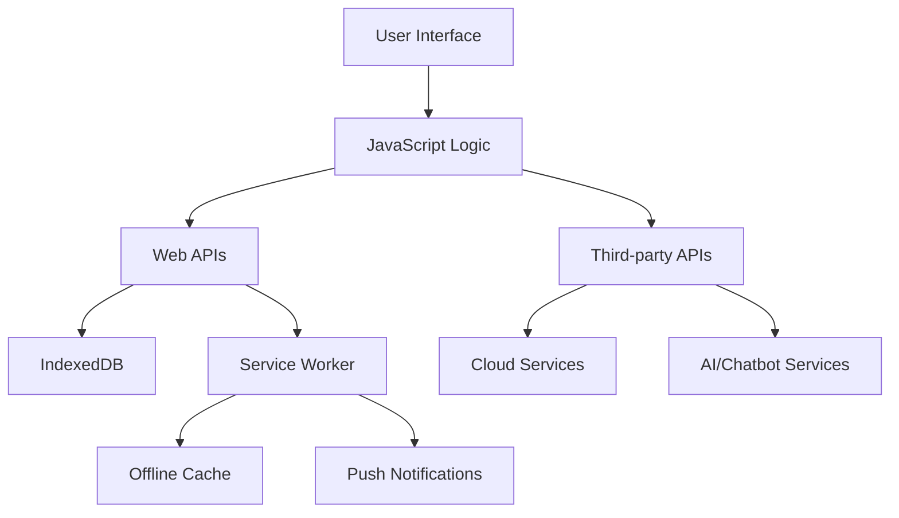

3# Mobile Application Feature Implementation Plan for Roshan Beats

## Overview
This plan outlines the implementation of 25 new features for the Roshan Beats music player, transitioning from a web-based app to a mobile application using HTML5, CSS3, JavaScript, and Web APIs. The existing codebase (index.html) provides a solid foundation with offline storage (IndexedDB), audio playback (Web Audio API), and responsive UI.

The app will be enhanced as a Progressive Web App (PWA) for mobile deployment, leveraging Service Workers for offline capabilities and modern Web APIs for native-like features.

## Technology Stack Assessment
- **Feasible with Web APIs**: Most features can be implemented using Web APIs (WebAuthn, Push, Payment Request, etc.)
- **Limitations**: Native features like advanced AR, health tracking, or blockchain may require alternatives or third-party integrations.
- **PWA Enhancements**: Add manifest.json, service worker for installability and background tasks.

## Feature Implementation Plans

### 1. Advanced User Authentication with Biometric Options
**Feasibility**: High - Use WebAuthn API for fingerprint/face ID on supported devices.
**Required APIs**: Web Authentication API, Credential Management API.
**UI Changes**: Add login screen with biometric prompt, user profile section in settings.
**Integration Points**: Integrate with IndexedDB for user-specific data storage. Add auth check on app load. Store credentials securely.
**Limitations**: Not supported on all browsers/devices; fallback to password auth.

### 2. Real-time Push Notifications with Customizable Categories
**Feasibility**: High - Use Push API and Service Worker.
**Required APIs**: Push API, Notifications API, Service Worker API.
**UI Changes**: Notification settings screen with category toggles (new songs, playlists, updates).
**Integration Points**: Register service worker on app init. Notify on song imports, playlist changes. Use existing audio events.
**Limitations**: Requires user permission; background push needs HTTPS.

### 3. In-app Purchases with Payment Gateways
**Feasibility**: High - Payment Request API supports Apple Pay/Google Pay.
**Required APIs**: Payment Request API.
**UI Changes**: Premium features section with purchase buttons (e.g., unlimited playlists, advanced EQ).
**Integration Points**: Integrate with existing settings screen. Store purchase status in IndexedDB. Unlock features post-purchase.
**Limitations**: Requires merchant account; no direct app store integration.

### 4. Offline Mode with Data Synchronization
**Feasibility**: High - Enhance existing offline capabilities.
**Required APIs**: Service Worker API, Background Sync API.
**UI Changes**: Offline indicator in mini player, sync progress bar.
**Integration Points**: Cache assets with Service Worker. Queue song imports/playlists for sync. Use existing IndexedDB for data.
**Limitations**: Sync requires internet reconnection; complex for large files.

### 5. Social Media Integration for Sharing Content
**Feasibility**: High - Web Share API for native sharing.
**Required APIs**: Web Share API, possibly Social APIs.
**UI Changes**: Share buttons on song/playlist items.
**Integration Points**: Add to existing song list and playlist screens. Share song metadata or playlist links.
**Limitations**: Limited to supported platforms; no direct social login.

### 6. Voice Command Recognition
**Feasibility**: High - Web Speech API.
**Required APIs**: Web Speech API (SpeechRecognition).
**UI Changes**: Voice command button in player controls, voice feedback UI.
**Integration Points**: Integrate with playback controls (play, next, etc.). Add to player screen.
**Limitations**: Requires microphone permission; accuracy varies.

### 7. Dark Mode Toggle with Automatic Scheduling
**Feasibility**: High - CSS and JS.
**Required APIs**: None (use prefers-color-scheme).
**UI Changes**: Enhance existing theme switcher with auto-schedule option.
**Integration Points**: Extend current theme system. Add scheduling logic with Date API.
**Limitations**: None.

### 8. Multi-language Support with Real-time Translation
**Feasibility**: Medium - Use Internationalization API or external services.
**Required APIs**: Internationalization API, Fetch API for translation services.
**UI Changes**: Language selector in settings, translated UI strings.
**Integration Points**: Wrap UI text in i18n functions. Store language preference in IndexedDB.
**Limitations**: Real-time translation requires API calls; offline limited.

### 9. Personalized Recommendations
**Feasibility**: High - JS algorithms.
**Required APIs**: None.
**UI Changes**: Recommendations section on home screen.
**Integration Points**: Analyze play history from existing data. Integrate with song list.
**Limitations**: Basic algorithms; no ML without libraries.

### 10. Cloud Backup and Restore
**Feasibility**: Medium - Integrate with cloud APIs (e.g., Google Drive).
**Required APIs**: Fetch API, File System Access API.
**UI Changes**: Backup/restore buttons in settings.
**Integration Points**: Export IndexedDB data to cloud. Use existing storage system.
**Limitations**: Requires user accounts; privacy concerns.

### 11. Augmented Reality Overlays
**Feasibility**: Medium - WebXR API.
**Required APIs**: WebXR API.
**UI Changes**: AR mode toggle in player, overlay on album art.
**Integration Points**: Add to player screen for interactive visuals.
**Limitations**: Limited device support; fallback to 2D overlays.

### 12. Health Tracking Integration
**Feasibility**: Low - Web Bluetooth for wearables.
**Required APIs**: Web Bluetooth API.
**UI Changes**: Health dashboard in settings.
**Integration Points**: Pair with wearables, display data alongside music.
**Limitations**: Requires compatible devices; privacy permissions.

### 13. Chatbot Support
**Feasibility**: High - Integrate with chatbot APIs.
**Required APIs**: Fetch API.
**UI Changes**: Chat widget in app.
**Integration Points**: Add to settings or as floating button.
**Limitations**: Requires internet; third-party service.

### 14. Gamification Elements
**Feasibility**: High - JS logic.
**Required APIs**: None.
**UI Changes**: Badges, leaderboards in profile section.
**Integration Points**: Track listening stats from existing playback.
**Limitations**: None.

### 15. Video Streaming with Adaptive Bitrate
**Feasibility**: High - Media Source Extensions.
**Required APIs**: Media Source Extensions API.
**UI Changes**: Video player mode for music videos.
**Integration Points**: Extend audio player to video.
**Limitations**: Requires video files; bandwidth dependent.

### 16. File Sharing with Encryption
**Feasibility**: High - WebRTC, Crypto API.
**Required APIs**: WebRTC API, Web Crypto API.
**UI Changes**: Share options with encryption settings.
**Integration Points**: Add to song sharing.
**Limitations**: P2P; requires both parties online.

### 17. Location-based Services
**Feasibility**: Medium - Geolocation API.
**Required APIs**: Geolocation API.
**UI Changes**: Location settings, geofenced playlists.
**Integration Points**: Suggest playlists based on location.
**Limitations**: Permission required; geofencing limited.

### 18. Accessibility Features
**Feasibility**: High - ARIA, CSS.
**Required APIs**: None.
**UI Changes**: High contrast mode, screen reader support.
**Integration Points**: Enhance existing UI with ARIA labels.
**Limitations**: None.

### 19. Data Analytics Dashboard
**Feasibility**: High - JS charting.
**Required APIs**: None (use Canvas or libraries).
**UI Changes**: Analytics screen in settings.
**Integration Points**: Analyze existing play data.
**Limitations**: Basic; no advanced analytics.

### 20. API Integrations
**Feasibility**: High - Fetch API.
**Required APIs**: Fetch API.
**UI Changes**: Weather/news widgets.
**Integration Points**: Add to home screen.
**Limitations**: Requires internet.

### 21. Multi-device Synchronization
**Feasibility**: Medium - Cloud sync.
**Required APIs**: Fetch API.
**UI Changes**: Sync status indicator.
**Integration Points**: Extend cloud backup.
**Limitations**: Requires account.

### 22. Emergency SOS
**Feasibility**: High - Geolocation, Share API.
**Required APIs**: Geolocation API, Web Share API.
**UI Changes**: SOS button in player.
**Integration Points**: Quick access in UI.
**Limitations**: Requires permissions.

### 23. Customizable Themes and Skins
**Feasibility**: High - CSS variables.
**Required APIs**: None.
**UI Changes**: Theme editor.
**Integration Points**: Extend existing themes.
**Limitations**: None.

### 24. AI-powered Content Generation
**Feasibility**: Medium - AI APIs.
**Required APIs**: Fetch API.
**UI Changes**: Auto-summary for playlists.
**Integration Points**: Add to playlist details.
**Limitations**: Requires API.

### 25. Blockchain-based Transactions
**Feasibility**: Low - Web3 APIs.
**Required APIs**: Web3 APIs (e.g., MetaMask).
**UI Changes**: Crypto wallet integration.
**Integration Points**: For purchases.
**Limitations**: Niche; requires wallet.

## Common Integration Points
- **IndexedDB**: Extend for user data, settings, analytics.
- **Service Worker**: For offline, push, sync.
- **UI Patterns**: Add new screens following existing modal/screen structure.
- **Permissions**: Handle API permissions gracefully.

## Architecture Diagram

## Next Steps
- Implement PWA manifest and service worker.
- Prioritize features based on feasibility (start with high-feasibility ones).
- Test on mobile devices for PWA compatibility.